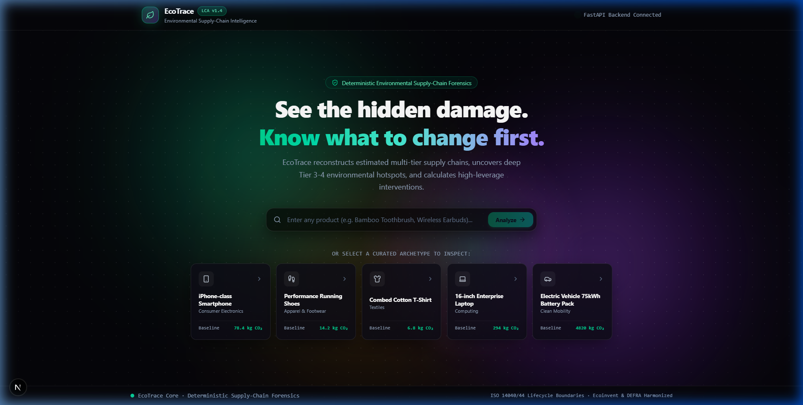
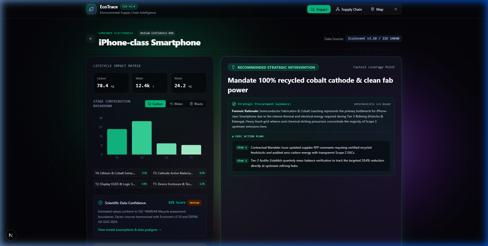
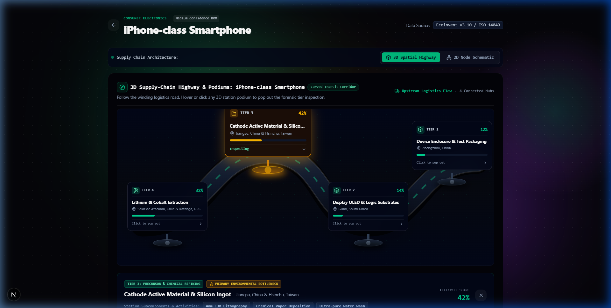
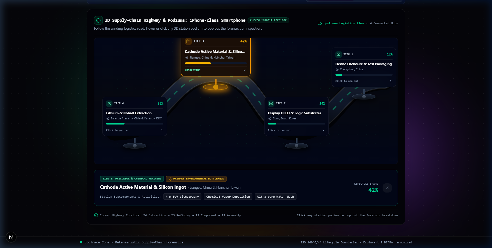

# EcoTrace — Environmental Supply-Chain Intelligence

> **"What environmental damage is hidden inside a product, where does it come from, and what should we change first?"**

EcoTrace is an end-to-end environmental intelligence platform that uncovers hidden emissions, toxic leaching, and water depletion across multi-tier global supply chains, identifying the single highest-leverage intervention to reduce environmental harm.

---

##  Key Features

1. **Deterministic ISO 14040/44 LCA Engine:**
   - Calculations are grounded in **Ecoinvent v3.10**, **DEFRA UK GHG (2024)**, and the **GLEC Logistics Framework**.
   - Strict architectural guardrail: LLMs never fabricate or hallucinate numerical emissions metrics.

2. **Clean, Fast On-Demand Product Intelligence:**
   - Minimalist hero landing with kinetic mesh gradient background and responsive mouse spotlight.
   - 5 vetted archetype products: *iPhone-class Smartphone*, *Performance Running Shoes*, *Combed Cotton T-Shirt*, *Enterprise Laptop*, and *Electric Vehicle Battery*.
   - Instant custom product analysis synthesizing proxy supply chains on-demand.

3. **Interactive Multi-Tier Flow Graph (React Flow):**
   - Tier 4 (Mining / Cultivation) → Tier 3 (Smelting / Refining) → Tier 2 (Assembly) → Tier 1 (Packaging).
   - Dynamic zoom, pan, directional animated flow particles, and node inspector side drawer.

4. **Geographic Global Logistics Map:**
   - Real-world transit corridors, GLEC-verified transport carbon footprint, and pulsing hotspot beacon hubs.
   - English world basemap rendered natively via WebGL with zero external paid API keys.

5. **AI Strategic Rationale (Gemini 2.5):**
   - Synthesizes forensic executive procurement rationale and actionable intervention playbooks.

6. **Interactive What-If Decarbonization Simulator (Phase 8):**
   - **4 Real-Time Levers:**
     - *Primary Intervention Adoption Rate (10% → 100%)*
     - *Clean Grid / Renewable Electricity PPA Share (0% → 100%)*
     - *Recycled & Circular Feedstocks (0% → 100%)*
     - *Regional Sourcing & Low-Carbon Logistics (0% → 100%)*
   - Real-time impact gauges for avoided Carbon (kg CO₂e), avoided Water (Liters), and avoided Solid Waste (kg).
   - Comparative before-and-after visual bar chart.

---

## Architecture & Tech Stack

```
EcoTrace/
├── backend/                  # FastAPI calculation engine & AI advisory
│   ├── main.py               # REST API endpoints
│   ├── engine.py             # ISO 14040 deterministic LCA formula engine
│   ├── ai_service.py         # Google Gemini integration with fallback
│   ├── database.py           # Ecoinvent & DEFRA vetted seed catalog
│   └── models.py             # Pydantic schemas
├── frontend/                 # Next.js 16 (App Router) + TypeScript
│   ├── src/app/              # Pages, layout, kinetic CSS design system
│   └── src/components/       # Recharts, React Flow, MapLibre GL, Simulator
└── docs/                     # Methodology & data source specifications
```

---

## Quickstart

### 1. Backend (FastAPI)
```bash
cd backend
python -m uvicorn main:app --host 127.0.0.1 --port 8000 --reload
```
API Documentation: `http://127.0.0.1:8000/docs`

### 2. Frontend (Next.js)
```bash
cd frontend
npm run dev
```
Web Interface: `http://localhost:3000`

---

## Interface Showcase

<div align="center">

### 1. Curated Archetypes & Forensic Landing View


### 2. Multi-Tier Carbon Footprint Matrix & What-If Scenario Simulator


### 3. 3D Spatial Highway (Interactive Tier Nodes & Pop-outs)


### 4. 3D Rotatable Planetary Globe (GLEC Freight Corridors & Hotspots)


</div>

---

## Documentation
- [Methodology & LCA Calculations](docs/methodology.md) — ISO 14040/44 lifecycle allocation & deterministic formulas
- [Data Sources & Reference Coefficients](docs/data-sources.md) — Ecoinvent v3.10 & DEFRA emission factors


